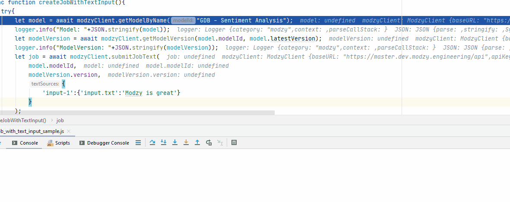

# Modzy Javascript SDK


<div align="center">

**Modzy's Javascript SDK queries models, submits inference jobs, and returns results directly to your editor.**


[The job lifecycle](https://models.modzy.com/docs/how-to-guides/job-lifecycle) | [API Keys](https://models.modzy.com/docs/how-to-guides/api-keys) | [Samples](https://github.com/modzy/sdk-javascript/tree/main/samples) | [Documentation](https://models.modzy.com/docs)

</div>

## Installation

[](https://asciinema.org/a/B1IkRkW4LjW7sufkjoMWoETH6)

Use [yarn](https://yarnpkg.com/) to package and install the SDK:

Globally:

- `$ yarn global add modzy-sdk`

In an existing project:

- `$ yarn add modzy-sdk`

Or you can use [npm](https://nodejs.org/):

Globally

- `$ npm install -g modzy-sdk`

In an existing project:

- `$ npm install modzy-sdk`

You can also install from Github:

- `$ npm install modzy/sdk-javascript`

## Initialize

Once you have a `model` and `version` identified, get authenticated with your API key.

API keys are security credentials required to perform API requests to Modzy. Our API keys are composed of an ID that is split by a dot into two parts: the prefix and the body. +
The *prefix* is the API keys' visible part. It’s only used to identify the key and by itself, it’s unable to perform API requests.

[List your API keys](https://models.modzy.com/docs/users-keys/api-keys/retrieve-users-api-keys):

```javascript
const keys = await modzyClient.getAccountingClient().getAPIKeys('your@email.com');
keys.forEach(
    key => {
        console.log(JSON.stringify(key));
    }
);
```

The *body* is the prefix’s complement and it’s required to perform API requests. Since it’s not stored on Modzy’s servers, it cannot be recovered. Make sure to save it securely. If lost, you can [replace the API key's body](https://models.modzy.com/docs/users-keys/api-keys/replace-API-key).

[Retrieve the API key's body](https://models.modzy.com/docs/users-keys/api-keys/retrieve-full-API-key):

```javascript
const hash = await modzyClient.getAccountingClient().getKeyBody('yourKey');
console.log("The hash is: "+hash);
```

Get authenticated with your API key:

```javascript
const modzy = require('modzy-sdk');
const modzyClient = new modzy.ModzyClient("http://url.to.modzy/api", "prefix.body");
```

## Basic usage



### Browse models

Modzy’s Marketplace includes pre-trained and re-trainable AI models from industry-leading machine learning companies, accelerating the process from data to value.

The Model service drives the Marketplace and can be integrated with other applications, scripts, and systems. It provides routes to list, search, and filter model and model-version details.

[List models](https://models.modzy.com/docs/marketplace/models/retrieve-models)

```javascript
const models = await modzyClient.getAllModels();
models.forEach(
    model => {
        console.log(JSON.stringify(model));
    }
);
```

Tags help categorize and filter models. They make model browsing easier.

[List tags](https://models.modzy.com/docs/marketplace/tags/retrieve-tags):

```javascript
const tags = await modzyClient.getAllTags();
tags.forEach(
    tag => {
        console.log(JSON.stringify(tag));
    }
);
```

[List models by tag](https://models.modzy.com/docs/marketplace/tags/retrieve-models-by-tags):

```javascript
const tagsModels = await modzyClient.getTagsAndModels("language_and_text");
tagsModels.models.forEach(
    model => {
        console.log(JSON.stringify(model));
    }
);
```

### Get a model's details

Models accept specific *input file [MIME](https://developer.mozilla.org/en-US/docs/Web/HTTP/Basics_of_HTTP/MIME_types) types*. Some models may require multiple input file types to run data accordingly. In this sample, we use a model that requires `text/plain`.

Models require inputs to have a specific *input name* declared in the job request. This name can be found in the model’s details. In this sample, we use a model that requires `input.txt`.

Additionally, users can set their own input names. When multiple input items are processed in a job, these names are helpful to identify and get each input’s results. In this sample, we use a model that requires `input-1` and `input-2`.

[Get a model's details](https://models.modzy.com/docs/marketplace/models/retrieve-model-details):

```javascript
const saModel = await modzyClient.getModel("ed542963de");
console.log(JSON.stringify(saModel));
```

Model specific sample requests are available in the version details and in the Model Details page.

[Get version details](https://models.modzy.com/docs/marketplace/versions/retrieve-version-details):

```javascript
let modelVersion = await modzyClient.getModelVersion("ed542963de", "0.0.27");
console.log("inputs:");
for(key in modelVersion.inputs){
    let input = modelVersion.inputs[key];
    console.log(`  key ${input.name}, type ${input.acceptedMediaTypes}, description: ${input.description}`);
}
console.log("outputs:");
for(key in modelVersion.outputs){
    let output = modelVersion.outputs[key];
    console.log(`  key ${output.name}, type ${output.mediaType}, description: ${output.description}`);
}
```

### Submit a job and get results

A *job* is the process that sends data to a model, sets the model to run the data, and returns results.

Modzy supports several *input types* such as `text`, `embedded` for Base64 strings, `aws-s3` and `aws-s3-folder` for inputs hosted in buckets, and `jdbc` for inputs stored in databases. In this sample, we use `text`.

[Here](https://github.com/modzy/sdk-javascript/blob/readmeUpdates/samples.adoc) are samples to submit jobs with `embedded`, `aws-s3`, `aws-s3-folder`, and `jdbc` input types.

[Submit a job with the model, version, and input items](https://models.modzy.com/docs/jobs/jobs/submit-job-text):

```javascript
let job = await modzyClient.submitJobText(
    "ed542963de",
    "0.0.27",
    {
        'input-1':{'input.txt':'Modzy is great'},
        'input-2':{'input.txt':'Modzy is great'},
    }
);
```

[Hold until the inference is complete and results become available](https://models.modzy.com/docs/jobs/jobs/retrieve-job-details):

```javascript
job = await modzyClient.blockUntilComplete(job);
```

[Get the results](https://models.modzy.com/docs/jobs/results/retrieve-results):

Results are available per input item and can be identified with the name provided for each input item upon job request. You can also add an input name to the route and limit the results to any given input item.

Jobs requested for multiple input items may have partial results available prior to job completion.

```javascript
let results = await modzyClient.getResult(job.jobIdentifier);
```

### Fetch errors

Errors may arise for different reasons. Fetch errors to know what is their cause and how to fix them.

Error      | Description
---------- | ---------
`ApiError` | Wrapper for different errors, check code, message, url attributes.


Submitting jobs:

```javascript
try{
    let job = await modzyClient.submitJobText("ed542963de","0.0.27",{'input-1':{'input.txt':'Modzy is great'},});
} catch(error){
    console.log("the job submission fails with code "+error.code+" and message "+error.message);
}
```

## Features

Modzy supports [batch processing](https://models.modzy.com/docs/features/batch-processing), [explainability](https://models.modzy.com/docs/features/explainability), and [model drift detection](https://models.modzy.com/docs/features/model-drift).

## APIs

Here is a list of Modzy APIs. To see all the APIs, check our [Documentation](https://models.modzy.com/docs/home/home).


| Feature | Code |Api route
| ---     | ---  | ---
|Retrieve all models|client.models.get_all()|[api/models](https://models.modzy.com/docs/api-reference/marketplace/retrieve-all-models-versions)|
|Retrieve some models|client.models.get_models()|[api/models](https://models.modzy.com/docs/api-reference/marketplace/retrieve-models)|
|Retrieve model details|client.models.get()|[api/models/:model-id](https://models.modzy.com/docs/api-reference/marketplace/retrieve-model-details)|
|Retrieve model by name|client.models.get_by_name()|[api/models](https://models.modzy.com/docs/api-reference/marketplace/retrieve-models)|
|Retrieve related models|client.models.get_related()|[api/models/:model-id/related-models](https://models.modzy.com/docs/api-reference/marketplace/retrieve-related-models)|
|Retrieve model versions|client.models.get_versions()|[api/models/:model-id/versions](https://models.modzy.com/docs/api-reference/marketplace/retrieve-versions)|
|Retrieve model version details|client.models.get_version()|[api/models/:model-id/versions/:version-id](https://models.modzy.com/docs/api-reference/marketplace/retrieve-version-details)|
|Retrieve all tags|modzyClient.getAllModels()|[api/models/tags](https://models.modzy.com/docs/api-reference/marketplace/retrieve-tags)|
|Retrieve Tags and Models|modzyClient.getTagsAndModels()|[api/models/tags/:tag-id](https://models.modzy.com/docs/api-reference/marketplace/retrieve-models-by-tags) |
|Submit a Job (Text)|modzyClient.submitJobText()|[api/jobs](https://models.modzy.com/docs/api-reference/job-inputs/submit-job)|
|Submit a Job (Embedded)|modzyClient.submitJobEmbedded()|[api/jobs](https://models.modzy.com/docs/api-reference/job-inputs/submit-job)|
|Submit a Job (AWS S3)|modzyClient.submitJobAWSS3()|[api/jobs](https://models.modzy.com/docs/api-reference/job-inputs/submit-job)|
|Submit a Job (JDBC)|modzyClient.submitJobJDBC()|[api/jobs](https://models.modzy.com/docs/api-reference/job-inputs/submit-job)|
|Cancel job|modzyClient.cancelJob()|[api/jobs/:job-id](https://models.modzy.com/docs/api-reference/jobs/cancel-pending-job)  |
|Hold until inference is complete|modzyClient.blockUntilComplete()|[api/jobs](https://models.modzy.com/docs/api-reference/jobs/retrieve-job-details)  |
|Get Job details|modzyClient.getJob()|[api/jobs/:job-id](https://models.modzy.com/docs/api-reference/jobs/retrieve-job-details)  |
|Retrieve results|modzyClient.getResults()|[api/jobs/:job-id](https://models.modzy.com/docs/api-reference/results/retrieve-results)  |
|Retrieve Job History|modzyClient.getJobHistory()|[api/jobs/history](https://models.modzy.com/docs/api-reference/jobs/retrieve-job-history)  |

## Samples

Check out our [samples](https://github.com/modzy/sdk-javascript/tree/main/samples) for details on specific use cases.

To run samples:

Set the base url and api key in each sample file:

```javascript
// TODO: set the base url of modzy api and you api key
const modzyClient = new modzy.ModzyClient("http://modzy.url", "modzy-apy.key");
```

Or follow the instructions [here](https://github.com/modzy/sdk-javascript/tree/main/contributing.adoc#set-environment-variables-in-bash) to learn more.

And then, you can:

```bash
`$ node samples/job_with_text_input_sample.js`
```
## Contributing

We are happy to receive contributions from all of our users. Check out our [contributing file](https://github.com/modzy/sdk-javascript/tree/main/contributing.adoc) to learn more.

## Code of conduct


[](https://github.com/modzy/sdk-javascript/tree/main//CODE_OF_CONDUCT.md)

